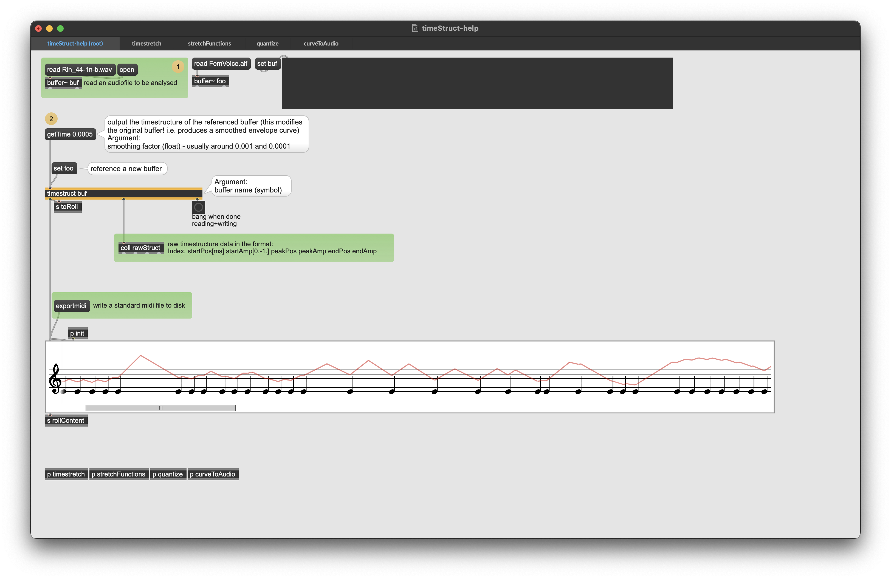
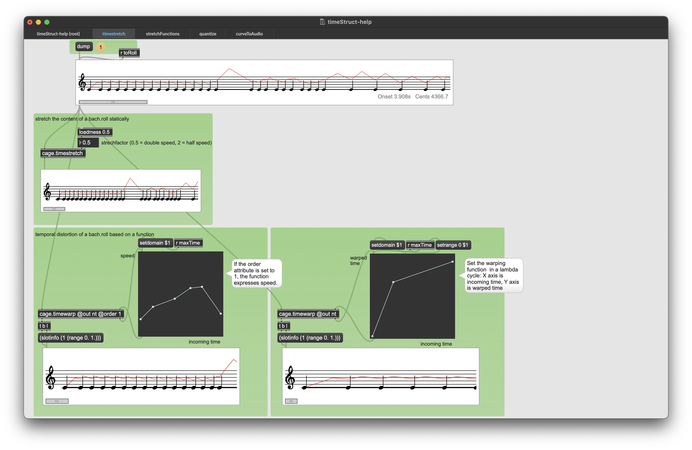
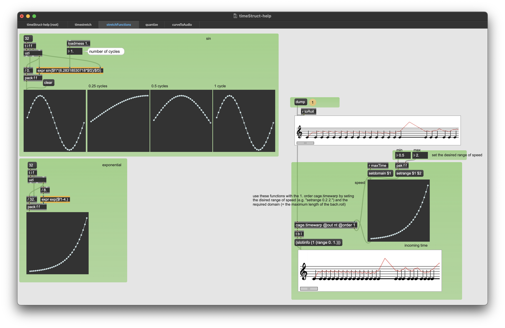
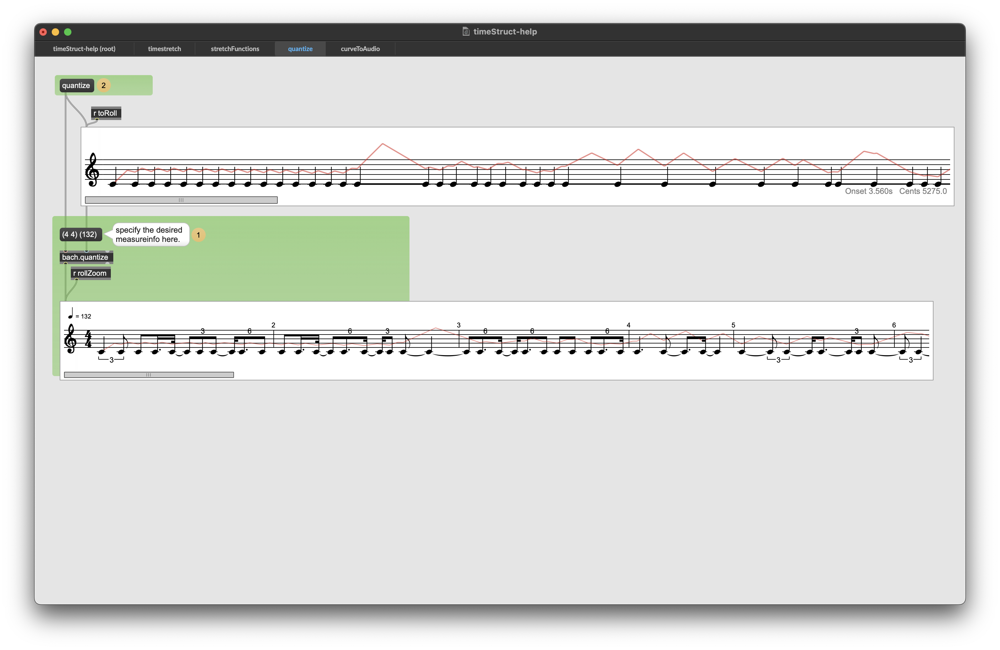
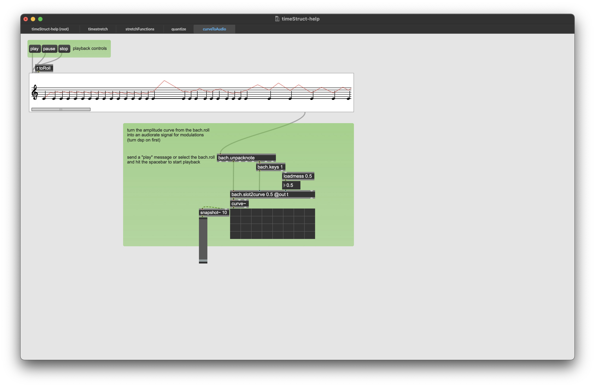

# timestruct
Max/MSP External - extracts the amplitude timing structure from an audio buffer via exponential smoothing
Takes an audio file as input and outputs the positions of amplitude peaks and troughs formatted as standard music notation as well as an audio buffer containing the amplitude envelope.

from there, all the usual bach and cage jazz can be done to the score data, i.e. static time-stretching

... or dynamic time-stretching

... quatization into a bar-grid

and finaly, the modified score data can be turned back into audio signal

